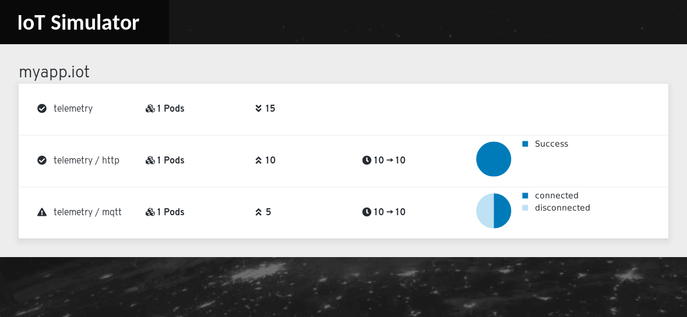

# Eclipse Hono™ Simulator

A set of tools for simulating an IoT workload for Eclipse Hono.
This supports generating MQTT and HTTP, telemetry and events.
It also allows records metrics to a prometheus instance for monitoring
and analysis.

## Operator

Deploying the different parts of the simulator can be tricky. But there is an
operator which will set up Prometheus, the web console and deploy the different
producer and consumers.

### OperatorHub.io

You can directly download install the operator via [OperatorHub.io](https://operatorhub.io/operator/iot-simulator "IoT simulator on OperatorHub.io").

### Manual operator installation

All you need is the [OLM](https://github.com/operator-framework/operator-lifecycle-manager "Operator Lifecycle Manager") installed and then:

    oc apply -f https://raw.githubusercontent.com/ctron/iot-simulator-operator/master/operator/iot-simulator-simulators.crd.yaml
    oc apply -f https://raw.githubusercontent.com/ctron/iot-simulator-operator/master/operator/iot-simulator-simulatorconsumers.crd.yaml
    oc apply -f https://raw.githubusercontent.com/ctron/iot-simulator-operator/master/operator/iot-simulator-simulatorproducers.crd.yaml
    oc apply -f https://raw.githubusercontent.com/ctron/iot-simulator-operator/master/operator/iot-simulator.v0.1.0.clusterserviceversion.yaml

Or, if you use plain Kubernetes:

    kubectl apply -f https://raw.githubusercontent.com/ctron/iot-simulator-operator/master/operator/iot-simulator-simulators.crd.yaml
    kubectl apply -f https://raw.githubusercontent.com/ctron/iot-simulator-operator/master/operator/iot-simulator-simulatorconsumers.crd.yaml
    kubectl apply -f https://raw.githubusercontent.com/ctron/iot-simulator-operator/master/operator/iot-simulator-simulatorproducers.crd.yaml
    kubectl apply -f https://raw.githubusercontent.com/ctron/iot-simulator-operator/master/operator/iot-simulator.v0.1.0.clusterserviceversion.yaml

Also see: [OLM scripts](https://github.com/ctron/iot-simulator-operator/tree/master/operator)

## Creating instances

First you need to create a simulator instance:

~~~yaml
apiVersion: iot.dentrassi.de/v1alpha1
kind: Simulator
metadata:
  name: hono1
  namespace: iot-simulator
spec:
  endpoint:
    messaging:
      user: foo
      password: bar
      host: messaging.host.hono.svc
      port: '5671'
      caCertificate: ''
    registry:
      url: 'https://your-device-registry'
      apiVersion: LEGACY # or V1
    adapters:
      mqtt:
        host: mqtt-adapter.hono.svc
        port: 8883
      http:
        url: 'https://http-adapter.hono.svc'
~~~

Followed by a consumer:

~~~yaml
apiVersion: iot.dentrassi.de/v1alpha1
kind: SimulatorConsumer
metadata:
  name: consumer1
  namespace: iot-simulator
spec:
  simulator: hono1
  tenant: myapp1.iot
  type: telemetry
  replicas: 1
~~~

And a producer:

~~~yaml
apiVersion: iot.dentrassi.de/v1alpha1
kind: SimulatorProducer
metadata:
  name: producer1
  namespace: iot-simulator
spec:
  simulator: hono1
  tenant: myapp1.iot
  type: telemetry
  protocol: http
  replicas: 1
  numberOfDevices: 10
~~~

## Web Console

The operator will allow you to deploy a web console alongside for a quick
overview.

Also see: [ctron/iot-simulator-console](https://github.com/ctron/iot-simulator-console "IoT simulator console")
